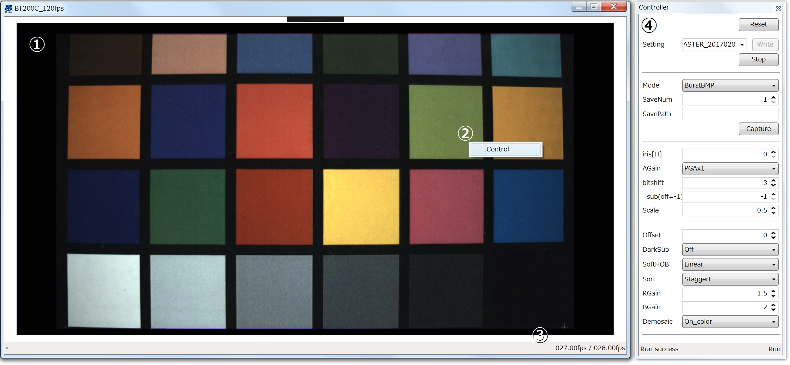

# BTCV

## Usage

### Description Screen



#### 1. Main View

#### 2. Context Menu

This is right-click context menus.  
You can show control panel("Controller").

#### 3. Status Bar

You can see frames per second.  
The right side shows ``` USB Communication Speed ```,  
the left side shows ``` Digital Image Process Speed ```.

#### 4. Controller

You can operate the camera with this panel.

- Reset

Initialize the CSI/FPGA.

- Setting Write

You can write CIS/FPGA settings from files.  
The files in the directory containing the exe file is displayed in the dropdown list, but you can also specify it directly.

- Run / Stop

Run Preview / Stop Preview

- Mode
- SaveNum
- SavePath

- iris

- AGain

- bitshift
- bitshift(sub)

- Scale

- Offset

- DarkSub

- SoftHob

- Sort

- Rgain
- BGain

- Demosaic
