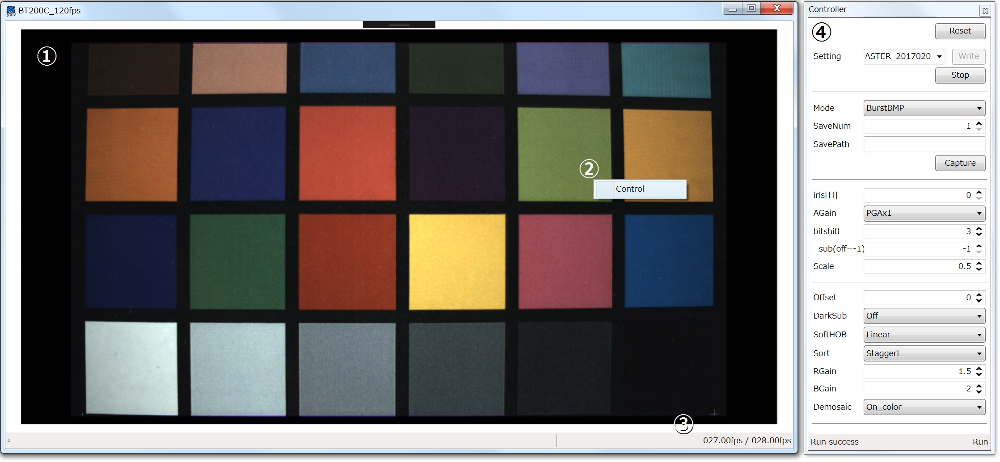

# BTCV

## Usage

### Description Screen



#### 1. Main View Window

This window shows live viewing images

#### 2. Context Menu

Context menu is opened by right-click on the view window. then, click  ```Control``` to show the control panel(```Controller```).

#### 3. Status Bar

Live viewing frame rate is displayed. The right side shows ``` USB Communication Speed ```, the left side shows ``` Digital Image Process Speed ```.  
The frame rate depends on the specifications of your PC. This software does not guarantee to work with 30 fps operation. Please refer to the frame rate value for operation.

#### 4. Controller

The BT200C camera system can be handled by this panel.

##### Reset

Initialize CIS and FPGA on the camera board.

##### Write Settings 

Set a camera configure file which CIS/FPGA settings are written and then click ```write``` botton to apply it to the camera.  
Camera configure files where located at the same directory of BTCV execute file are displayed in the dropdown list. You can also specify it directly.

##### Run / Stop

Run Preview / Stop Preview

##### Mode / SaveNum / SavePath / Capture

Save image data to your PC.
If select ```BurstBMP``` or ```BurstRaw```, multiple images can be stored consecutively. Please note that this mode doesn't guarantee to grab image data with specified maximum rate.
Images with specified maximum rate are acquired by use of ```RecRaw``` mode.

##### iris

The exposure time can be handled by this setting.
Ranging between 1 to 596 is available.

##### AGain

Analog gain (PGA) can be selected by this setting.

##### bitshift / bitshift(sub) [^Note]

Raw data of BT200C has deeper bit depth. In order to display in Windows OS, it must be limited to 8 bits.  
When set to ``` 0 ```, the lowest 8 bits(LSB) images are displayed.  
When set to ``` 4 ```, images ranging from 4 to 11 bits are displayed.

If set ``` bitshift(sub) ```, different bit range images can be displayed as split viewing image in the view window.

Since WhiteClip processing is not implemented in this software, it is necessary to pay attention to color misregistration at saturation.

##### Scale [^Note]

The scale of live viewing image can be adjusted.


##### Offset [^Note]

The black level can be adjusted.


##### DarkSub [^Note]

If use the dark image subtraction for defect correction and black level correction, please put ```dark.bin``` file into the same directory of BTCV execute file as a dark output image.


##### SoftHob [^Note]

Perform horizontal noise reduction processing.

| item | Description |
| :--- | :--- |
| Off | |
| Left | use HOB on Left sides |
| Both | use HOB on both sides |
| Linear | Linear interpolation is performed on the left and right using HOB on both sides  |

##### Sort [^Note]


If you want to see an image where pixels are aligned correctly, you need to set it exactly.

The default setting of BT200C is ```StaggerL```.

##### Rgain / BGain [^Note]

Set the color gain.

##### Demosaic [^Note]

| item | Description |
| :--- | :--- |
| Through | Display image data as close to raw as possible. For analysis. |
| Off | Display image without demosaicing. |
| On_Mono | Display image with demosaicing and grayscale conversion. |
| On_Color | Display image with demosaicing. |
| Quadrant | For analysis. |
| QuadColor | For analysis. |
| Binning | Only for binning drive. |

This function does not process gamma and color matrix.  
If you want an image that is close to the actual development processing, you need to develop from raw data yourself.

[^Note]:This function is not reflected in the raw data.

please be aware that this is an evaluation environment for BT200C sensor.
